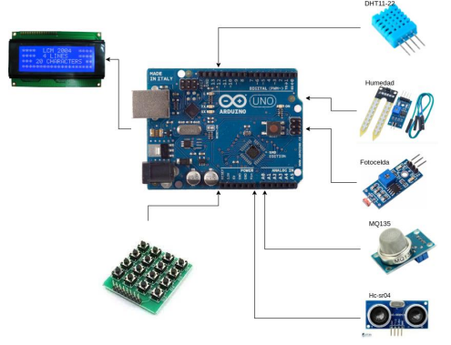
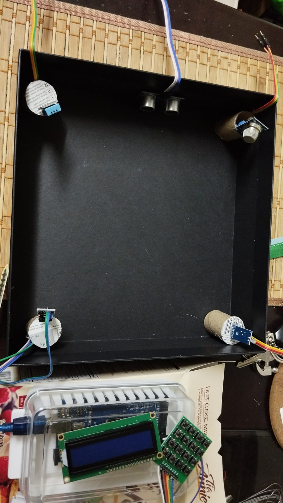
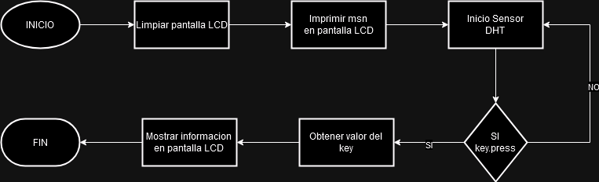

>
>
>Universidad San Carlos de Guatemala
>
>Facultad de Ingeniería 
>
>Escuela de Ciencias y Sistemas 
>
>Primer Semestre, 2024
>
>Laboratorio de Arquitectura de Computadores y Ensambladores 2

### Grupo No. 2

Integrantes:

| Nombre                               | Carnet    | 
| ------------------------------------ | --------- | 
|  &nbsp;Uzzi Libni Aarón Pineda Solórzano          | 201403541 | 
|  &nbsp; Juan Orlando Cabrera          | 200112856 |
|  &nbsp; José Fernando Recinos Acuté           | 201114236 | 
|   &nbsp; Melyza Alejandra Rodríguez Contreras | 201314821 | 

## CONTROL DEL AMBIENTE, EN DORMITORIOS INTELIGENTES IMPLEMENTANDO ANALISIS METEOROLÓGICO IoT

Una estación meteorológica de IoT es un sistema avazado de monitoreo que integra diversos sensores para recopilar datos climáticos en tiempo real. Esta estación está diseñada para recopilar información sobre cuatro variables principales:

    1. Temperatura.
    2. Iluminación.
    3. Humedad.
    4. Concentración de Co2 en el aire.

Este sistema de estación meteorológica IoT recopila los datos de estos sensores y los envía a una plataforma centralizada implementando un sistema de cola de mensajes (**MQTT**). Los datos se almacenan en una **base de datos** y pueden visualizarse, implementando una **aplicación web**. Esto permite que los usuarios monitoreen y accionen sobre los diversos componentes que administra la estación.

## FUNCIONES

    - MEDICIÓN DE TEMPERATURA        
    - CANTIDAD DE LUZ AMBIENTAL
    - MEDICIÓN DE CALIDA DE AIRE
    - MEDICIÓN DE PROXIMIDAD

## OBJETIVO DEL DISPOSITIVO
El propósito del sistema es gestionar un ambiente inteligente en una habitación, con la capacidad de asegurar condiciones saludables para el ocupante y controlar los gastos energéticos analizando la información obtenida.

## DESCRIPCIÓN DE CAPAS
    - Hardware
        - Uso de Microcontrolador Arduino.
        - Implementación de Sensores.
            - Sensor de temperatura y humedad.
                - Dht11
                - Dht22
            - Sensor de movimiento
                - Sensor Ultrasonido HC-SR04
                - Implementación de led infrarrojo
            - Sensor de iluminación
                - Fotocelda
                - Modulo TCS3200
            - Sensor de Co2
                - MQ135
            - Pantalla LCD
    - Software
        - Arduino IDE
        - Python (Opcional)
    - Plataforma
        - Pantalla LCD

## FLUJO DEL SISTEMA

- Los sensores deescritos realizarán lecturas del ambiente, para trasladar estos datos al microcontrolador Arduino.

- Luego de contar con los datos en el sistema, dicha información, será presentada implementando una pantalla LCD. Con el objetivo de mostrar información al usuario, se necesita implementar, botones que permitan interactuar con el microcontrolador.

- Los botones tendrán la capacidad de mostrar información en tiempo real.

- Para mostrrar la información histórica es necesario el uso de memoria EEPROM ya que se necesita guardar la información resultante de la diversidad de sensores, implementando un botón exclusivo, que permita generar el guardado de información.

FIGURA NO.1

## MAQUETA

FIGURA NO.2

En la siguiente imagen podemos encontrar los sensores utilizados en este proyecto siendo estos:
 - Sensor de temperatura DHT
 - Sensor de movimiento Ultrasonico HC-SR04
 - Fotocelda
 - Sensor de CO2 MQ135

Tambien podemos apreciar un Arduino Uno, una pantalla LCD y una matriz de celda.

## DIAGRAMA DE FLUJO

FIGURA NO.3: Comportamiento del codigo implementado en Arduino.

## LIBRERIAS UTILIZADAS EN EL PROYECTO
1. Wire
2. LiquidCrystal_I2C
3. Keypad
4. DHT
5. EEPROM

## VARIABLES Y METODOS UTILIZADOS
TABLA NO.1: Nombre y Tipo de Variables
| NOMBRE VARIABLE | TIPO | DESCRIPCIÓN | PIN ARDUINO |
| ------ | ------ | ------ | ------ |
| eepromAddress | int | Direccion de memoria EEPROM para almacenar los datos de los sensores. |  |
| pinButtonCO2 | int | Pin vinculado al sensor del CO2, dicho sensor envia la informacion al arduino. | 10 |
| pinButtonFoto | int | Pin vinculado al sensor de fotoresistencia, dicho sensor envia la informacion al arduino. | 11 |
| pinHumedad | int | Pin vinculado al sensor de humedad, dicho sensor envia la informacion al arduino. | 12 |
| ROWS | byte | Variable utilizada para moverse en la matriz de botones. |  |
| COLS | byte | Variable utilizada para moverse en la matriz de botones. |  |

TABLA NO.2: Nombre y tipo de metodos
| NOMBRE | TIPO | DESCRIPCION |
| ------ | ------ | ------ |
| readSensors | void | Este metodo lee la informacion enviada de los sensores y los guarda en las variables declaradas en la Tabla No.1  |
| readUltrasonicSensor | int | Metodo para calcular la distancia de la habitacion. |
| processKeypad | void | Metodo utilizado para procesar la informacion del teclado, este metodo recibe como parametro un char. Dicho parametro permite mostrar los datos guardados en las variables descritas en la Tabla No.1 |
| printAllSensor | void | Muestra toda la informacion guardada de los sensores. |
| nivelLuz | String | Este metodo recibe un parametro de tipo int, el cual permite determinar si la luz es Alta, media o baja. |
| saveDataToEEPROM | void | Ingresa informacion en la memoria EEPROM.  |
| displaySavedData | void | Lee los valores almacenados en la memoria EEPROM. |
