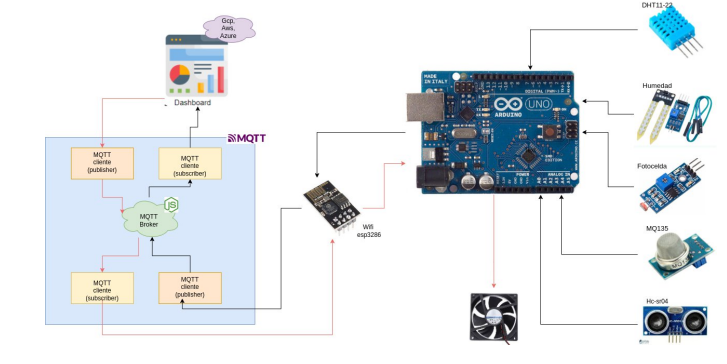

>
>
>Universidad San Carlos de Guatemala
>
>Facultad de Ingeniería 
>
>Escuela de Ciencias y Sistemas 
>
>Primer Semestre, 2024
>
>Laboratorio de Arquitectura de Computadores y Ensambladores 2

### Grupo No. 2 
# Fase 2

Integrantes:

| Nombre                               | Carnet    | 
| ------------------------------------ | --------- | 
|  &nbsp;Uzzi Libni Aarón Pineda Solórzano          | 201403541 | 
|  &nbsp; Juan Orlando Cabrera          | 200112856 |
|  &nbsp; José Fernando Recinos Acuté           | 201114236 | 
|   &nbsp; Melyza Alejandra Rodríguez Contreras | 201314821 | 

## CONTROL DEL AMBIENTE, EN DORMITORIOS INTELIGENTES IMPLEMENTANDO ANALISIS METEOROLÓGICO IoT

Una estación meteorológica de IoT es un sistema avazado de monitoreo que integra diversos sensores para recopilar datos climáticos en tiempo real. Esta estación está diseñada para recopilar información sobre cuatro variables principales:

    1. Temperatura.
    2. Iluminación.
    3. Humedad.
    4. Concentración de Co2 en el aire.

Este sistema de estación meteorológica IoT recopila los datos de estos sensores y los envía a una plataforma centralizada implementando un sistema de cola de mensajes (**MQTT**). Los datos pueden visualizarse, implementando una **aplicación web**. Esto permite que los usuarios monitoreen y accionen sobre los diversos componentes que administra la estación.

## FUNCIONES

    - MEDICIÓN DE TEMPERATURA        
    - CANTIDAD DE LUZ AMBIENTAL
    - MEDICIÓN DE CALIDAD DE AIRE
    - MEDICIÓN DE PROXIMIDAD
    - ACCIONAMIENTO REMOTO DE VENTILADOR
    - DASHBOARD DINAMICO CON INFORMACIÓN EN TIEMPO REAL

## OBJETIVO DEL DISPOSITIVO
El propósito del sistema es gestionar un ambiente inteligente en una habitación, con la capacidad de asegurar condiciones saludables para el ocupante y controlar los gastos energéticos analizando la información obtenida. Así mismo, monitorear de manera remota la información actual del ambiente y poder accionar un ventilador en el momento en que se desee. 

## DESCRIPCIÓN DE CAPAS
    - Hardware
        - Uso de Microcontrolador Arduino.
        - Implementación de Sensores.
            - Sensor de temperatura y humedad.
                - Dht11
                - Dht22
            - Sensor de movimiento
                - Sensor Ultrasonido HC-SR04
                - Implementación de led infrarrojo
            - Sensor de iluminación
                - Fotocelda
                - Modulo TCS3200
            - Sensor de Co2
                - MQ135
            - Comunicación
                - Módulo WiFi ESP32
            
    - Software
        - Arduino IDE
        - NodeJS

        
    - Cloud Platform 
        - Google Coud Platform

> 
>
> Google Cloud Platform (GCP) es una plataforma de servicios en la nube ofrecida por Google que proporciona una amplia gama de herramientas y servicios para ayudar a las organizaciones a construir, implementar y escalar aplicaciones y servicios en la infraestructura de Google. GCP ofrece servicios de cómputo, almacenamiento, bases de datos, redes, inteligencia artificial, aprendizaje automático y más, todo ello bajo un modelo de pago por uso flexible y escalable. Con una red global de centros de datos, seguridad de primer nivel y un enfoque en la innovación continua, Google Cloud Platform es una opción popular para empresas de todos los tamaños que buscan aprovechar la potencia y la confiabilidad de la infraestructura en la nube de Google para impulsar su transformación digital y alcanzar sus objetivos comerciales.

## FLUJO DEL SISTEMA

- ### Recolección de datos:
   Los sensores descritos realizarán lecturas del ambiente, para trasladar estos datos al microcontrolador Arduino.

- ### Conexión a la Red WiFi:

Programar el Arduino para que se conecte a la red WiFi utilizando el módulo correspondiente y proporcionando las credenciales de la red (SSID y contraseña).
Conexión al Broker MQTT:

Configurar los parámetros de conexión al servidor MQTT (también conocido como broker). Esto incluye la dirección IP del broker, el puerto y cualquier credencial necesaria para la autenticación.

- ### Publicación de Datos:

Para el manejo de los datos recolectados por los sensores, se utilizaron las siguientes variables: 

|Nombre de la variable|Topic |  Mensaje|
|--|--|--|
|mqtt_topic|allSensors|Todos los sensores|
|mqtt_topic_temp|temperatura|Lectura del sensor de temperatura|
|mqtt_topic_co2|co2|Lectura del sensor de calidad del aire|
|mqtt_topic_humidity|humedad|Lectura del sensor de humedad|
|mqtt_topic_distance|distancia|Lectura del sensor ultrasónico|

- ### Recepción de Datos:

En el extremo receptor (aplicacion web para el caso de la lectura de sensores), suscribirse al mismo topic MQTT al que el Arduino está publicando los datos para mostrarlos

FIGURA NO.1

## MAQUETA

FIGURA NO.2

En la siguiente imagen podemos encontrar los sensores utilizados en este proyecto siendo estos:
 - Sensor de temperatura DHT
 - Sensor de movimiento Ultrasonico HC-SR04
 - Fotocelda
 - Sensor de CO2 MQ135
 - Módulo WiFi ESP32
 - Ventilador de 5V

Tambien podemos apreciar un Arduino Uno como microcontrolador.

## DIAGRAMA DE FLUJO

## LIBRERIAS UTILIZADAS EN EL PROYECTO
1. Wire
2. DHT
3. EEPROM
4. SoftwareSerial.h

## VARIABLES Y METODOS UTILIZADOS
TABLA NO.1: Nombre y Tipo de Variables
| NOMBRE VARIABLE | TIPO | DESCRIPCIÓN | PIN ARDUINO |
| ------ | ------ | ------ | ------ |
| eepromAddress | int | Direccion de memoria EEPROM para almacenar los datos de los sensores. |  |
| pinButtonCO2 | int | Pin vinculado al sensor del CO2, dicho sensor envia la informacion al arduino. | 10 |
| pinButtonFoto | int | Pin vinculado al sensor de fotoresistencia, dicho sensor envia la informacion al arduino. | 11 |
| pinHumedad | int | Pin vinculado al sensor de humedad, dicho sensor envia la informacion al arduino. | 12 |
| ROWS | byte | Variable utilizada para moverse en la matriz de botones. |  |
| COLS | byte | Variable utilizada para moverse en la matriz de botones. |  |

TABLA NO.2: Nombre y tipo de metodos
| NOMBRE | TIPO | DESCRIPCION |
| ------ | ------ | ------ |
| readSensors | void | Este metodo lee la informacion enviada de los sensores y los guarda en las variables declaradas en la Tabla No.1  |
| readUltrasonicSensor | int | Metodo para calcular la distancia de la habitacion. |
| processKeypad | void | Metodo utilizado para procesar la informacion del teclado, este metodo recibe como parametro un char. Dicho parametro permite mostrar los datos guardados en las variables descritas en la Tabla No.1 |
| printAllSensor | void | Muestra toda la informacion guardada de los sensores. |
| nivelLuz | String | Este metodo recibe un parametro de tipo int, el cual permite determinar si la luz es Alta, media o baja. |
| saveDataToEEPROM | void | Ingresa informacion en la memoria EEPROM.  |
| displaySavedData | void | Lee los valores almacenados en la memoria EEPROM. |
