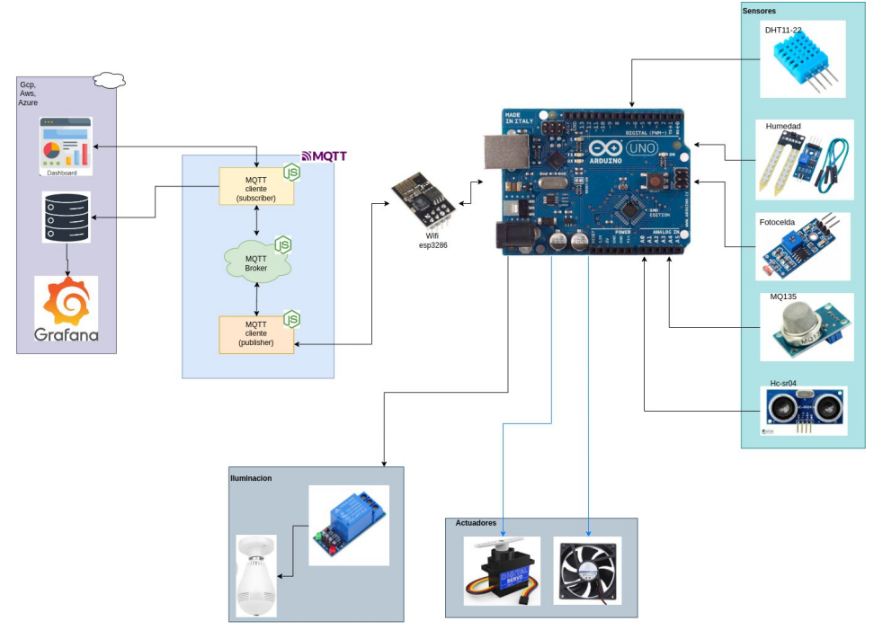
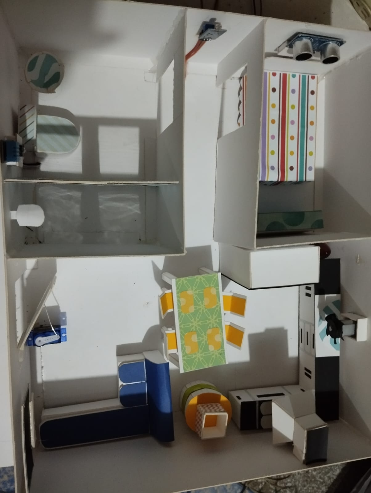
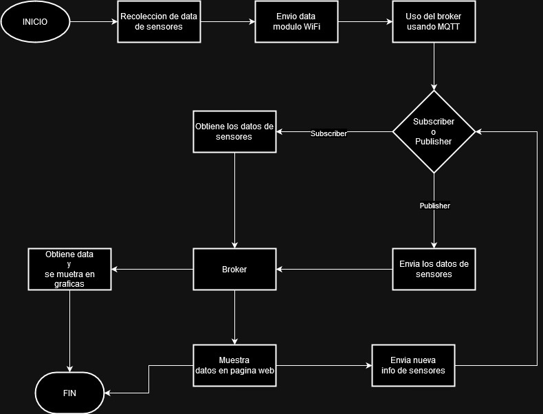
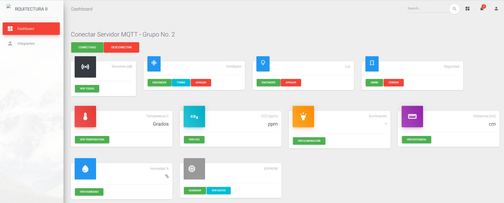
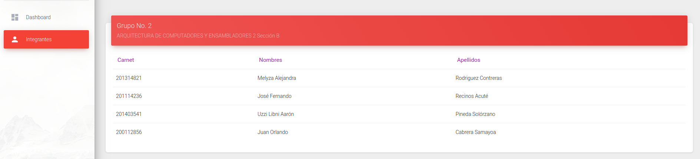
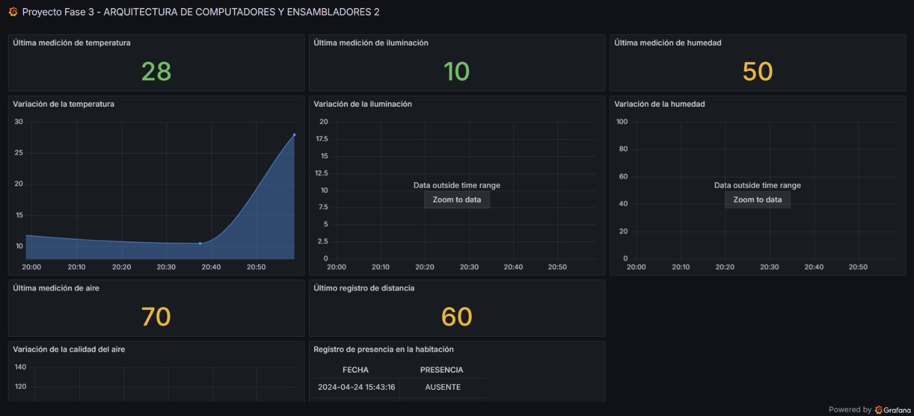
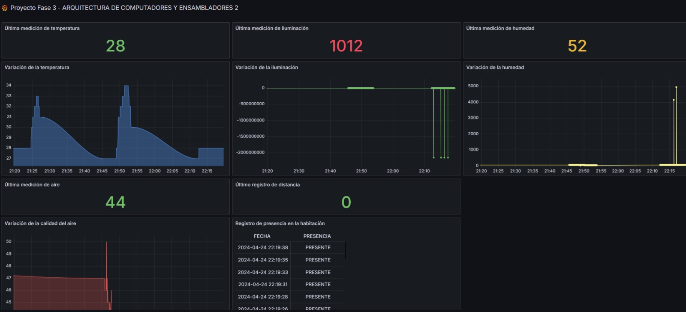
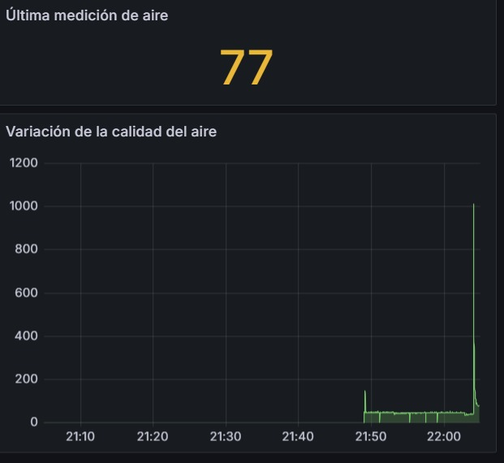

> 
>
> Universidad San Carlos de Guatemala
>
> Facultad de Ingeniería
>
> Escuela de Ciencias y Sistemas
>
> Primer Semestre, 2024
>
> Laboratorio de Arquitectura de Computadores y Ensambladores 2

### Grupo No. 2

# Fase 3

Integrantes:

| Nombre                                                                                                                                                                                                                | Carnet    |
| --------------------------------------------------------------------------------------------------------------------------------------------------------------------------------------------------------------------- | --------- |
|  &nbsp;Uzzi Libni Aarón Pineda Solórzano     | 201403541 |
|  &nbsp; Juan Orlando Cabrera                 | 200112856 |
|  &nbsp; José Fernando Recinos Acuté          | 201114236 |
|  &nbsp; Melyza Alejandra Rodríguez Contreras | 201314821 |

## CONTROL DEL AMBIENTE, EN DORMITORIOS INTELIGENTES IMPLEMENTANDO ANALISIS METEOROLÓGICO IoT

Una estación meteorológica de IoT es un sistema avazado de monitoreo que integra diversos sensores para recopilar datos climáticos en tiempo real. Esta estación está diseñada para recopilar información sobre cuatro variables principales:

    1. Temperatura.
    2. Iluminación.
    3. Humedad.
    4. Concentración de Co2 en el aire.

Este sistema de estación meteorológica IoT recopila los datos de estos sensores y los envía a una plataforma centralizada implementando un sistema de cola de mensajes (**MQTT**). Los datos pueden visualizarse, implementando una **aplicación web**. Esto permite que los usuarios monitoreen y accionen sobre los diversos componentes que administra la estación.

## FUNCIONES

    - MEDICIÓN DE TEMPERATURA
    - CANTIDAD DE LUZ AMBIENTAL
    - MEDICIÓN DE CALIDAD DE AIRE
    - MEDICIÓN DE PROXIMIDAD
    - ACCIONAMIENTO REMOTO DE VENTILADOR
    - DASHBOARD DINAMICO CON INFORMACIÓN EN TIEMPO REAL
    - INTERACCION CON LA ILUMINACION DE LA HABITACION
    - ANALISIS DE LIMPIEZA, EN EL AIRE EN LA HABITACION
    - ANALISIS DE TEMPERATURA DENTRO DE LA HABITACION
    - SISTEMA DE SEGURIDAD (HABILITAR ENTRADA/SALIDA DE LA HABITACION)
    - APLICACION WEB PARA VISUALIZAR GRAFICOS HISTORICOS SOBRE LA DATA DE LOS SENSORES

## OBJETIVO DEL DISPOSITIVO

El propósito del sistema es gestionar un ambiente inteligente en una habitación, con la capacidad de asegurar condiciones saludables para el ocupante y controlar los gastos energéticos analizando la información obtenida. Así mismo, monitorear de manera remota la información actual del ambiente y poder accionar un ventilador en el momento en que se desee.

## DESCRIPCIÓN DE CAPAS

    - Hardware
        - Uso de Microcontrolador Arduino.
        - Implementación de Sensores.
            - Sensor de temperatura y humedad.
                - Dht11
                - Dht22
            - Sensor de movimiento
                - Sensor Ultrasonido HC-SR04
                - Implementación de led infrarrojo
            - Sensor de iluminación
                - Fotocelda
                - Modulo TCS3200
            - Sensor de Co2
                - MQ135
            - Comunicación
                - Módulo WiFi ESP32
            - Actuadores
                - Ventilador 5V

    - Software
        - Arduino IDE
        - NodeJS
        - MQTT
        - Grafana

    - Cloud Platform
        - Google Coud Platform

    - Base de Datos
        - Grafana

> 
>
> **_AWS Amazon Web Services_** Es una plataforma de servicios en la nube ofrecida por Amazon.com. AWS ofrece una amplia gama de servicios de computación en la nube, incluyendo almacenamiento, bases de datos, análisis, inteligencia artificial, aprendizaje automático, Internet de las cosas (IoT), seguridad y mucho más. Estos servicios son ofrecidos en forma de servicios web, permitiendo a empresas y desarrolladores acceder y utilizar infraestructura informática sin necesidad de construir o mantener sus propios centros de datos físicos. AWS es una de las principales plataformas de servicios en la nube y es utilizada por empresas de todo el mundo para ejecutar sus aplicaciones y servicios en línea.

> 
>
> **_Grafana_** Es una solución de código abierto que sirve para ejecutar análisis de datos, extraer métricas que dan sentido ante enormes cantidades de datos y monitorear aplicaciones y recursos de hardware con la ayuda de atractivos paneles de control personalizables. Grafana es una herramienta de interfaz de usuario centralizada en la obtención de datos a partir de consultas, como también del almacenamiento de estos y su visualización. Es completament de código abierto, y está respaldada por una gran comunidad entusiasta y dedicada.

## CONSIDERACIONES

Los datos obtenidos por medio de los sensores se les asigno las siguientes unidades de medida:

1. Temperatura en la habitacion (°C)
2. Cantidad de luz en la habitación (Lumen)
3. Calidad del aire (Co2 ppm)
4. Humedad en el ambiente (%)

## FLUJO DEL SISTEMA

- ### RECOLECCION DE DATOS:

  Los sensores descritos realizarán lecturas del ambiente, para trasladar estos datos al microcontrolador Arduino.

- ### CONEXION A LA RED WiFi:

Programar el Arduino para que se conecte a la red WiFi utilizando el módulo correspondiente y proporcionando las credenciales de la red (SSID y contraseña).
Conexión al Broker MQTT:

Configurar los parámetros de conexión al servidor MQTT (también conocido como broker). Esto incluye la dirección IP del broker, el puerto y cualquier credencial necesaria para la autenticación.

- ### CONECTIVIDAD:

El dispositivo estará constituido por un Arduino que recopila los daots de los sensores descritos y luego envía esta información a través de una cola de mensajes utilizando un servicio Publisher, Subscriber (MQTT). Estos datos se almacenan de forma persistente en una base de datos (En la nube).

- ### PUBLICACION DE DATOS:

Para el manejo de los datos recolectados por los sensores, se utilizaron las siguientes variables:

| Nombre de la variable    | Topic         | Mensaje                                |
| ------------------------ | ------------- | -------------------------------------- |
| mqtt_topic               | allSensors    | Todos los sensores                     |
| mqtt_topic_temp          | temperatura   | Lectura del sensor de temperatura      |
| mqtt_topic_co2           | co2           | Lectura del sensor de calidad del aire |
| mqtt_topic_humidity      | humedad       | Lectura del sensor de humedad          |
| mqtt_topic_distance      | distancia     | Lectura del sensor ultrasónico         |
| mqtt_topic_lumus         | luminosidad   | Lectura del sensor ultrasónico         |
| mqtt_topic_guardar       | guardar       | Guardado en memoria                    |
| mqtt_topic_leer          | leer          | Lectura de memoria                     |
| mqtt_topic_ventiladorOn  | ventiladorON  | Encendido del ventilador               |
| mqtt_topic_ventiladorOff | ventiladorOFF | Apagado del ventilador                 |

- ### RECEPCION DE DATOS:

En el extremo receptor (aplicacion web para el caso de la lectura de sensores), suscribirse al mismo topic MQTT al que el Arduino está publicando los datos para mostrarlos luego Grafana se conecta con MQTT para la obtencion de datos y poder realizar las graficas.



## MAQUETA



En la siguiente imagen podemos encontrar los sensores utilizados en este proyecto siendo estos:

- Sensor de temperatura DHT
- Sensor de movimiento Ultrasonico HC-SR04
- Fotocelda
- Sensor de CO2 MQ135
- Módulo WiFi ESP32
- Ventilador de 5V
- Servo Motor

## DIAGRAMA DE FLUJO



## LIBRERIAS UTILIZADAS EN EL PROYECTO

1. Wire
2. DHT
3. EEPROM
4. Wifi.h
5. PubSubClient.h
6. Servo.h

## VARIABLES Y METODOS UTILIZADOS

**TABLA NO.1**: Nombre y Tipo de Variables

| NOMBRE VARIABLE | TIPO | DESCRIPCIÓN                                                                               | PIN ARDUINO |
| --------------- | ---- | ----------------------------------------------------------------------------------------- | ----------- |
| eepromAddress   | int  | Direccion de memoria EEPROM para almacenar los datos de los sensores.                     | 0           |
| pinButtonCO2    | int  | Pin vinculado al sensor del CO2, dicho sensor envia la informacion al arduino.            | A6          |
| pinButtonFoto   | int  | Pin vinculado al sensor de fotoresistencia, dicho sensor envia la informacion al arduino. | A7          |
| DHTPIN          | int  | Pin vinculado al sensor de humedad, dicho sensor envia la informacion al arduino.         | 3           |
| DHTPIN2         | int  | Pin vinculado al sensor de temperatura, dicho sensor envia la informacion al arduino.     | 4           |
| pinVentilador   | int  | Pin vinculado al ventilador.                                                              | 10          |
| trigger         | int  | Utilizado para el sensor ultrasónico                                                      | 5           |
| echo            | int  | Utilizado para el sensor ultrasónico                                                      | 6           |

<br>

**TABLA NO.2**: Nombre y tipo de metodos

| NOMBRE                 | TIPO   | DESCRIPCION                                                                                                                                                                                           |
| ---------------------- | ------ | ----------------------------------------------------------------------------------------------------------------------------------------------------------------------------------------------------- |
| readSensors            | void   | Este metodo lee la informacion enviada de los sensores y los guarda en las variables declaradas en la Tabla No.1                                                                                      |
| readUltrasonicSensor   | int    | Metodo para calcular la distancia de la habitacion.                                                                                                                                                   |
| processKeypad          | void   | Metodo utilizado para procesar la informacion del teclado, este metodo recibe como parametro un char. Dicho parametro permite mostrar los datos guardados en las variables descritas en la Tabla No.1 |
| printAllSensor         | void   | Muestra toda la informacion guardada de los sensores.                                                                                                                                                 |
| nivelLuz               | String | Este metodo recibe un parametro de tipo int, el cual permite determinar si la luz es Alta, media o baja.                                                                                              |
| saveDataToEEPROM       | void   | Ingresa informacion en la memoria EEPROM.                                                                                                                                                             |
| displaySavedData       | void   | Lee los valores almacenados en la memoria EEPROM.                                                                                                                                                     |
| sendSensorDataToESP32  | void   | Envia los datos de los sensores al ESP32.                                                                                                                                                             |
| accionesIndividuales   | void   | Envia los datos de una lectura específica al ESP32.                                                                                                                                                   |
| processSpecialMessages | void   | Publica los datos en el topic                                                                                                                                                                         |
| setup_wifi             | void   | Realiza la conexión WiFi                                                                                                                                                                              |
| reconnect              | void   | Realiza la subscripción a los diferentes topics                                                                                                                                                       |
| callback               | void   | Lee los mensajes recibidos de los diferentes topics y realiza acciones                                                                                                                                |
| apiAllSensores         | void   | Obtiene los valores de los sensores los convierte a enteros y los almacena en un array, luego los envia por endpoints                                                                                 |
| api                    | void   | Realiza la conexion con la api                                                                                                                                                                        |
| abrirPuerta            | void   | Analiza los movimientos del servo para abrir la puerta                                                                                                                                                |
| cerrarPuerta           | void   | Analiza los movimientos del servo para cerrar la puerta                                                                                                                                               |
| motorControl           | void   | Realiza los movimientos del motor                                                                                                                                                                     |
| motorApagar            | void   | Apaga los movimientos del motor                                                                                                                                                                       |

## COFIGURACION WiFi

La configuración WiFi se llevò a cabo por medio de la librería WiFi.h, haciendo uso del struct WiFiClient.

<br>

**TABLA No.3**: Parámetros de configuración

| Parámetro      | Descripción                  |
| -------------- | ---------------------------- |
| SSID           | Nombre de la red inalámbrica |
| PASSWORD       | Password asignado            |
| WiFi.status()  | Estado de la conexión        |
| WiFi.localIP() | Dirección IP asignada        |

Para inicializar la conexión utilizamos el siguiente mètodo

```
  WiFi.begin(ssid, password);
```

## DASHBOARD

<p>El dashboard utilizado para visualizar la información recolectada por los sensores, así como para accionar el ventilador, puede ser accedido en el siguiente enlace o <a  href="http://35.171.4.152/dist/#/dashboard"> pulse aquí  </a> para verlo</p>


<a  href="http://35.171.4.152/dist/#/dashboard">http://35.171.4.152/dist/#/dashboard </a>





<br>

<p> A continuacion se muestra el dashboard utilizado en grafana, tambien puede visualizar la pagina dando click en el siguiente enlace <a href="https://mlzdrg792.grafana.net/public-dashboards/77644f50bfe841b0a53ef44b6cee81ea?orgId=1&refresh=5s"> pulse aquí </a>.
</p>







## CONFIGURACION DE ENDPOINTS (COMUNICACION GRAFANA)

**TABLA No.4**: Nombre y como enviar data en los endpoints

| Metodo | Nombre Endpoint | Ejemplo              |
| ------ | --------------- | -------------------- |
| POST   | /addTemperatura | {"temperatura":10.5} |
| POST   | /addHumedad     | {"humedad":15.5}     |
| POST   | /addIluminacion | {"iluminacion":7.5}  |
| POST   | /addDistancia   | {"distancia":5.4}    |
| POST   | /addAire        | {"aire":12.5}        |
